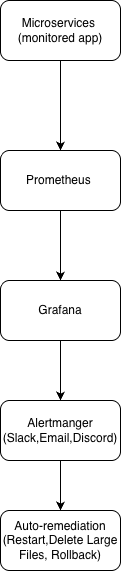
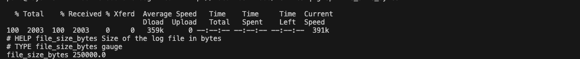
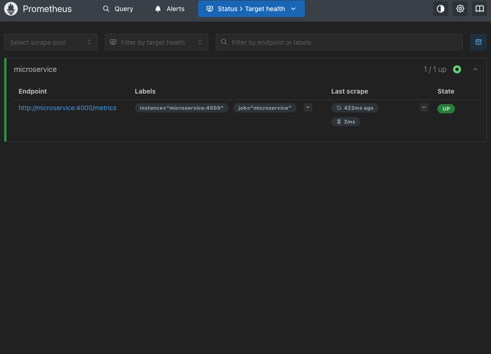
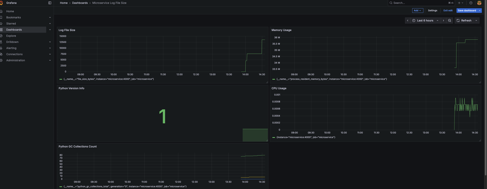
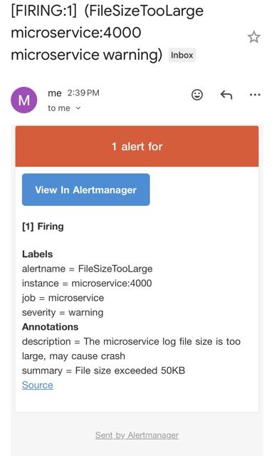
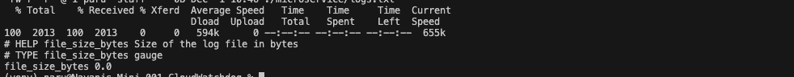
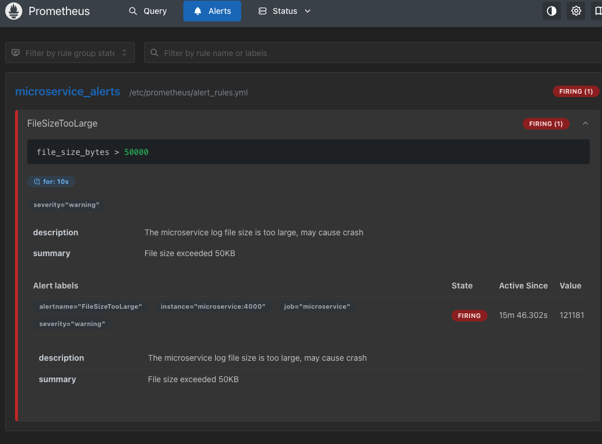
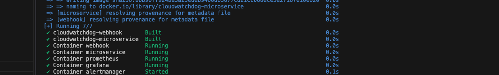

# CloudWatchdog 

## Project Overview
This project demonstrates an auto-remediation setup for microservices. The system monitors log file sizes of a microservice, triggers alerts if the file grows beyond a threshold, sends emails via Alertmanager, and automatically resets the log file through a webhook to prevent crashes.


- **Goal:** Monitor microservice log file sizes, send alerts, and **auto-remediate** oversized log files to ensure stability.

---

## Architecture


**Flow:**
1. Microservice writes logs to `logs.txt`.  
2. Prometheus scrapes metrics from the microservice (log file size in bytes).  
3. Alertmanager evaluates alert rules:
   - If `file_size_bytes > 50KB` for 10s → triggers **FileSizeTooLarge alert**.  
4. Alertmanager routes the alert to:
   - Email notification (`email-alert`)  
   - Webhook receiver (`auto-remediation`)  
5. Webhook receives alert and executes `fix_issue.sh` to reset the log file.  
6. Grafana dashboards visualize metrics for monitoring.

---

## How It Works

1. **Microservice exposes metrics**:
   - `/metrics` endpoint provides `file_size_bytes` for Prometheus.  

2. **Prometheus monitors metrics**:
   - Scrapes microservice metrics at configured intervals.  
   - Evaluates alert rules defined in `alert_rules.yml`.

3. **Alertmanager sends alerts**:
   - Email alert to configured address if the log file exceeds threshold.  
   - Webhook triggers **auto-remediation** script to reset the log file.

4. **Auto-remediation**:
   - Flask webhook (`webhook.py`) listens for POST requests from Alertmanager.  
   - Executes `fix_issue.sh` which truncates `logs.txt` to prevent microservice crash.  

5. **Docker ensures persistence**:
   - `logs.txt` is mounted as a volume to persist changes.  
   - Each service runs in its container for isolation.
     
### Docker Setup
All components are containerized using `docker-compose.yml`:
- Ports: Microservice (4000), Prometheus (9090), Grafana (3000), Alertmanager (9093), Webhook (5001).
- Shared volume: `logs.txt` is shared between microservice and webhook for remediation.
---

## Screenshots

### 1. Microservice Metrics
Shows the log file size metrics exposed by the microservice.


### 2. Prometheus Dashboard
Prometheus view showing active metrics and configured alerts.


### 3. Grafana Dashboard
Visual representation of metrics and alerts from Prometheus.


### 4. Alertmanager Email Alert
Email notification triggered when log file size exceeds the threshold.


### 5. Auto-Remediation Triggered
Webhook successfully triggered to truncate the oversized log file.


### 6. Microservice Alerts Overview
Overview of active alerts and microservice health metrics.


### 7. Docker Containers
All running containers used in this project.

## Commands to Run Locally

**Start services with Docker Compose:**
```bash
docker-compose down
docker-compose up -d --build
```
## Testing Auto-Remediation

### 1. Increase Log File Size Manually

Simulate a large log file:

```bash
yes "DATA" | head -n 50000 >> microservice/logs.txt
curl http://localhost:4000/metrics | grep file_size_bytes -Observe metrics via:
```

### 2. Trigger Webhook Manually (Test Auto-Remediation)

Send a POST request to the webhook to simulate the alert:Example POST command to test:
```bash
curl -X POST http://localhost:5001 -H "Content-Type: application/json" -d '{"alertname":"FileSizeTooLarge"}'
```
### 3. Verify Auto-Remediation
Webhook successfully triggered to truncate the oversized log file.

### Check logs.txt size
```bash
ls -lh microservice/logs.txt
```
## Auto-Remediation Effect

- After the alert is triggered, the webhook truncates the log file.  
- Verify that the file size resets to 0B and the microservice continues to run normally.

## Why This Project

- Log file growth can cause microservice crashes.  
- Alerts without remediation may notify but leave services unstable.  
- This project ensures automatic mitigation of high-risk conditions via:
-   Prometheus monitoring
-   Alertmanager notifications
-   webhook-triggered auto-remediation
-   Provide **automated remediation** to prevent crashes or downtime.
-    Ensure **continuous observability** of microservices, even under high load or misbehavior.
-    Reduce manual intervention during critical periods of outages or abnormal events.
  
   Inspired by real-world Cloudflare and other SaaS outages, ensuring system reliability and uptime even under unexpected log growth.


